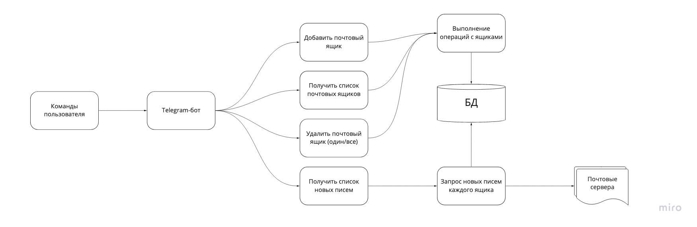
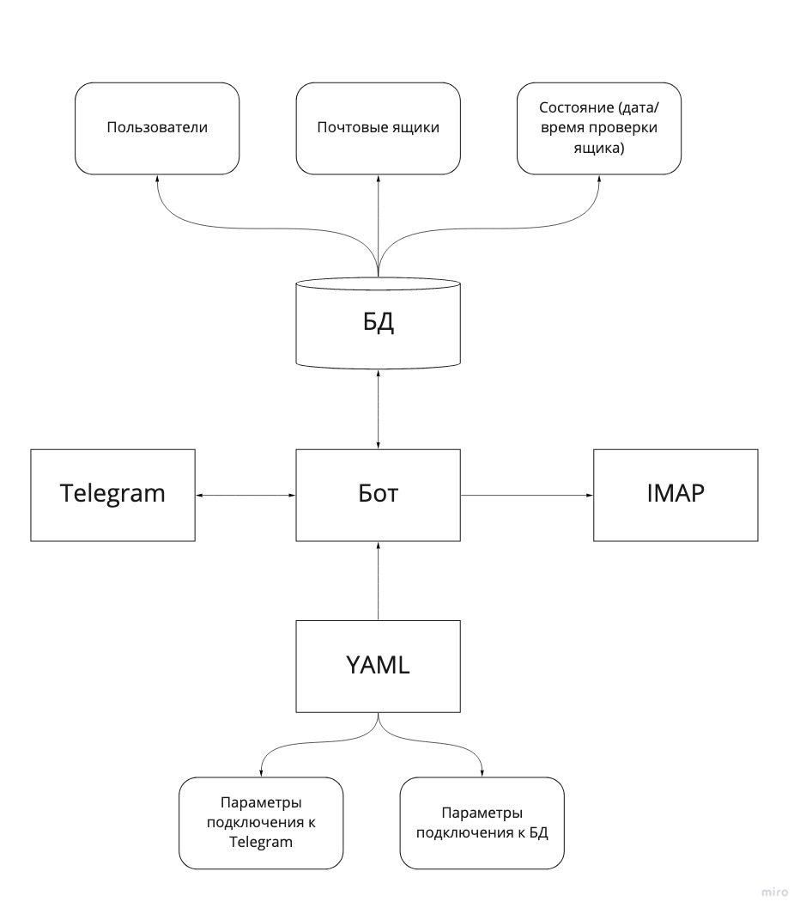
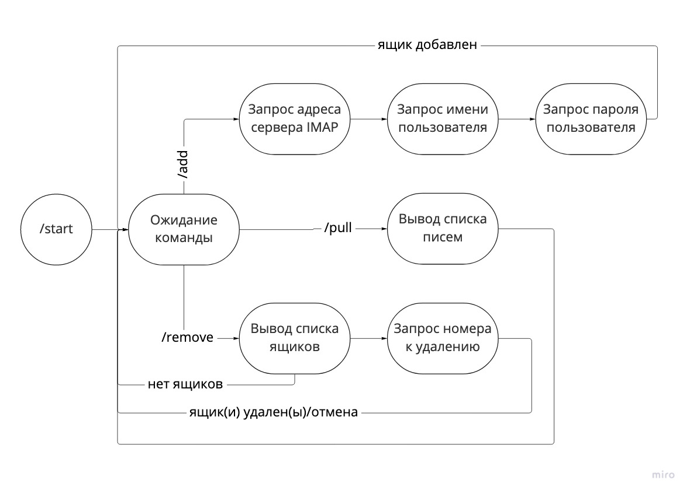

# Homework 2 - Почтовый бот

Бот, позволяет агрегировать информацию с нескольких почтовых ящиков о новых сообщениях в почте. Необходимые возможности:

1. Подключение ящиков по IMAP
2. Отключение ящиков
3. Получение свежих сообщений в режиме онлайн (пулинг ящиков)

## Идея реализации

### Процесс

1. Бот получает сообщения из Telegram от подписанных пользователей.
2. Пользователи имеют возможность давать команды на добавление/просмотр/удаления ящиков.
    * в рамках информации о ящике предоставляется адрес imap-сервера с портом, имя пользователя, пароль;
    * сообщение с паролем удаляется из чата *(проверить наличие такой возможности в API)*;
    * если пользователь не указал пароль, то можно спрашивать его каждый раз (но польза от такого бота сомнительна);
    * можно предлагать создать мастер-пароль, тогда при наличии нескольких ящиков достаточно будет указает его в качестве ключа расшифровки, см. п 3.
3. Информация о пользователях и их ящиках сохраняется в БД. Пароль сохраняется в зашифрованном виде. 
    * в простейшем случае ключ шифрования один;
    * чуть сложнее - индивидуальный для каждого пользователя;
    * также он может задаваться пользователем в виде мастер-пароля для одновременного доступа ко всем ящикам.
4. Пользователь может запросить новую почту.
    * бот получает список ящиков из базы;
    * расшифровывает пароли;
    * получает письма из данных ящиков;
    * возвращает пользователю список писем (либо новых в смысле "не прочитанные", либо в смысле "с прошлого запроса");
    * если писем больше некоторого количества, то выдавать самые свежие с возможность навигации по списку.
5. Пользователь может запросить удаление всех ящиков.

### Данные

Настройки (yaml+env):

* ключ доступа к Telegram;
* параметры подключения к БД;
* ключ шифрования паролей (в зависимости от реализации);
* дополнительные параметры (значение таймаутов, адрес и порт прослушивания и т.д.).

База данных:

* пользователь (id Telegram, последняя команда);
* почтовый ящик (id владельца, адрес, зашифрованный пароль, параметры сервера);
* состояние ящика (дата/время последней проверки).

## MVP

В рамках минимальной реализации будут реализованы следующие команды в Telegram:

1. /add - добавить ящик, далее запрашивается адрес ящика, имя пользователя, пароль. Сообщение с паролем в итоге удаляется из чата.
2. /remove - отображает нумерованный список ящиков. Ввод номер ящика удаляет его. Ввод `*` удаляет все ящики. Любое другое сообщение отменяет удаление.
3. /pull - запрос новых сообщения в понятии "непрочитанные" *(требуется дополнительный анализ возможностей IMAP)*.
4. /help - справка по командам.

Пароли хранятся в БД зашифрованные единым ключом.

## Рабочие заметки

### Telegram

Регистрация webhook: `curl "https://api.telegram.org/bot$TELEGRAM_TOKEN/setWebhook" -H "Content-Type: application/json" -d '{"url":"https://bot.something.ru/secret_token"}'`

Удаление webhook: `curl "https://api.telegram.org/bot$TELEGRAM_TOKEN/deleteWebhook"`
